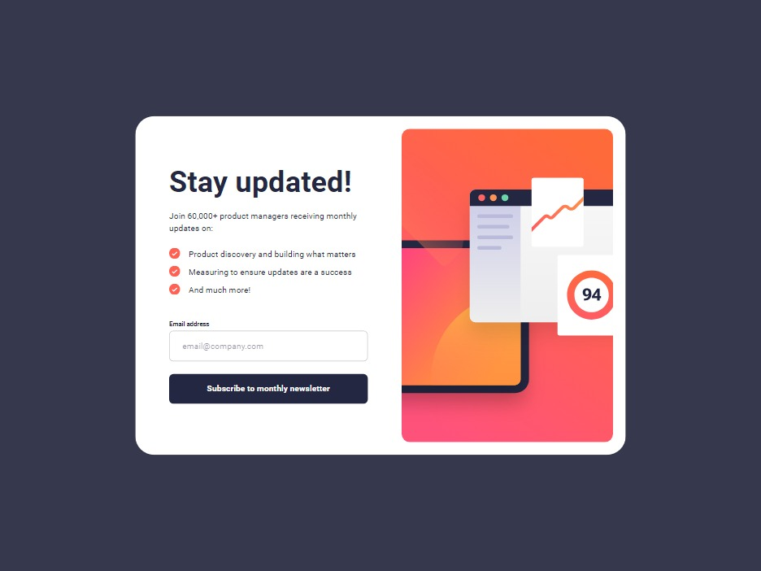

# Frontend Mentor - Newsletter sign-up form with success message solution

A solution provide by jefflangtech [Newsletter sign-up form with success message challenge on Frontend Mentor](https://www.frontendmentor.io/challenges/newsletter-signup-form-with-success-message-3FC1AZbNrv).

## Table of contents

- [Overview](#overview)
  - [The challenge](#the-challenge)
  - [Screenshot](#screenshot)
  - [Links](#links)
- [My process](#my-process)
  - [Built with](#built-with)
  - [Step by step](#step-by-step)
  - [Continued development](#continued-development)
- [Author](#author)

## Overview

### The challenge

Users should be able to:

- Add their email and submit the form
- See a success message with their email after successfully submitting the form
- See form validation messages if:
  - The field is left empty
  - The email address is not formatted correctly
- View the optimal layout for the interface depending on their device's screen size
- See hover and focus states for all interactive elements on the page

### Screenshot

### Links

- Solution URL: [Add solution URL here](https://your-solution-url.com)
- Live Site URL: [https://jefflangtech.github.io/newsletter-signup/index.html](https://jefflangtech.github.io/newsletter-signup/index.html)

## My process

### Built with

- Semantic HTML5 markup
- CSS custom properties
- CSS Grid
- Mobile-first workflow
- Regex
- History API

### Step by step

**Layout notes**

I saw a Kevin Powell video in which he remarked that he'll print out layouts and then draw on them by hand. I thought maybe I could do the same in photoshop and so far it's worked out pretty good.

For **desktop** it looks like there is a pretty standard padding that gets used around the edges of the component, as well as inline padding for the text portion of the grid, plus some additional left padding for both the left and right sides. I'm going to do a 2 cell grid, and the text portion will have its own grid as well.

**Mobile** is pretty interesting. The grid can shift to 1 column and I'm thinking that what I will do is transition the phone layout to have an additional padding like the desktop, as well as show the background color, when it expands out to a tablet view (768px).

It looks like the 'footer' portion where the subscribe/dismiss buttons are is the same dimension, so that container can have one style used across 2 different states. I think even the h1 is styled the same, with the same spacing, so it's a matter of a smaller image and less text shown. So when it shrinks down in content shown I'll want it to auto-adjust the top and bottom margins.

AND IS THAT GOING TO WORK WITH MY GRID IDEA?! Time to find out haha!

**Project plan**
I'm going to build this as an SPA starting with the mobile layout first and then migrating up in size. There isn't a tablet view provided so I'll modify the mobile view for tablet. Grid seems the best way to organize the sections of the component, especially as they move. I'll be trying a Regex implementation for email validation...and I'll try to understand it at the same time!

The list items will have custom decorations which are the provided SVG checkmarks. I can set those up as ::before pseudoelements.

The action for the component is:
Email validation -> submit & load new content -> Submit (dismiss button) & reload page

1. Project plan (0:31)
2. Layout notes (0:44)
3. Design system - the readme file provided didn't seem to match (0:23)
4. Create a task list (0:10)
5. HTML and styles for mobile view (1:35)
6. Preliminary validation tests (0:06)
7. Email validation with regex (2:45) - also implemented some basic testing
8. Media queries for tablet view (0:27)
9. Media queries for desktop view (1:00)
10. Create a functionality plane with task list (0:50)
11. Code the history update and functionality prior to response content (1:00)
12. Style mobile response (1:02)
13. Style desktop response (0:08)
14. Back button/dismiss button functionality (1:17)

Total time: 12:14 hrs

### Continued development

I built this over a long period of time and that did not work out in my favor. I was really working to keep my CSS tight, concise, and flexible but I also, I suppose, did not have good notes, so when I came back to this project after a long enough break I forgot where I was heading to. I felt like I would probably just scrap it all or band-aid it, and this time I opted for the band-aid. Next project I'll iterate on some of the things I learned here, and then I'll also just make sure I get regular touch points so I don't completely forget where I was going with something.

## Author

- Website - [JeffLangTech](https://jefflangtech.github.io/)
- Frontend Mentor - [@jefflangtech](https://www.frontendmentor.io/profile/jefflangtech)